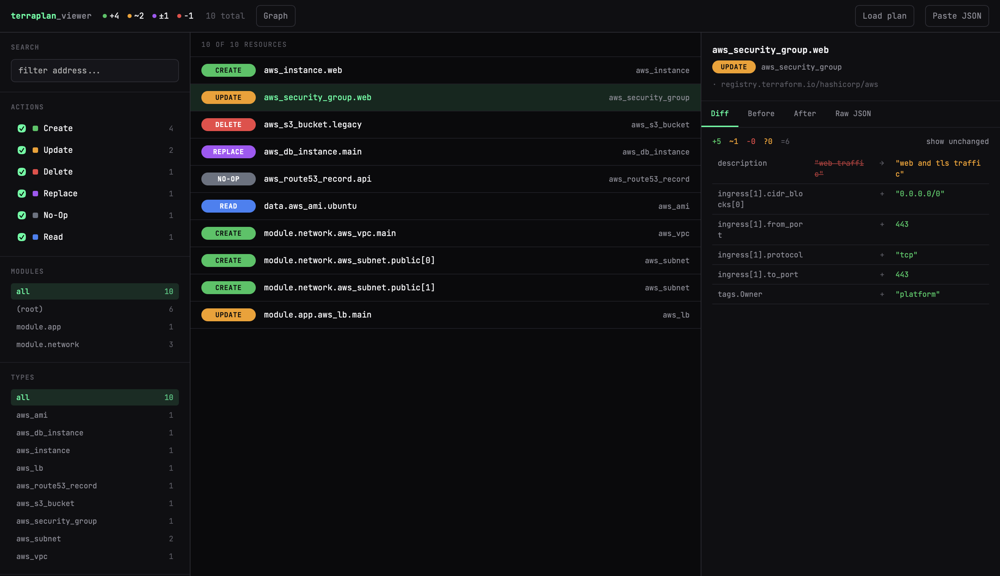
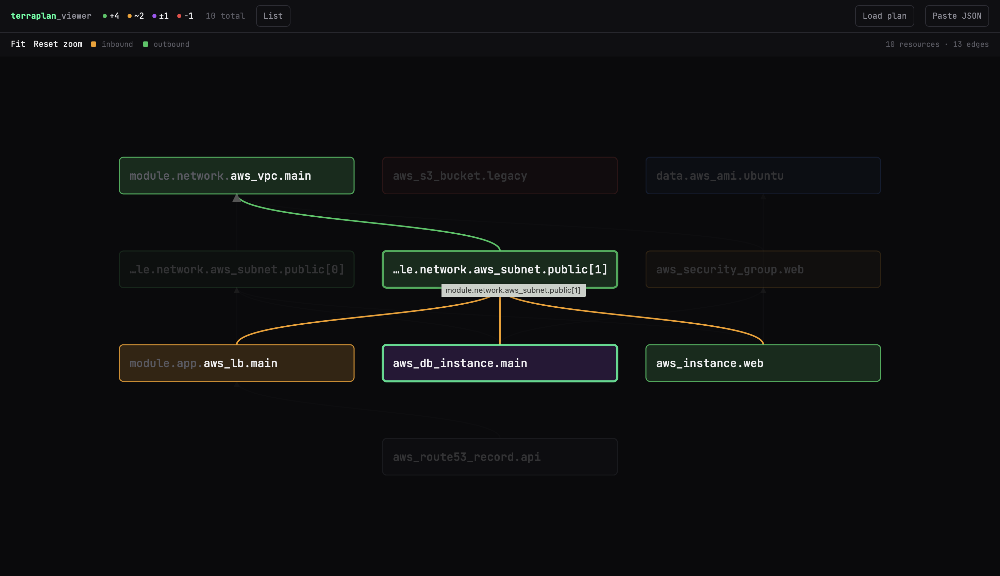

# Terraplan Viewer

A single-file, zero-dependency browser tool for exploring Terraform plan JSON output.

**[Live demo → terraplan-viewer.vercel.app](https://terraplan-viewer.vercel.app)**




## Usage

1. Open `index.html` in a browser (no server required)
2. Drop a `plan.json`, browse to one, or paste the JSON directly
3. Filter by action type, module, or resource type
4. Click any resource to inspect the before/after attribute diff

### Generating a plan file

```bash
terraform plan -out=tfplan
terraform show -json tfplan > plan.json
```

## Features

- **Action filters** — create / update / delete / replace / no-op / read
- **Module & type filters** — click to narrow by module path or resource type
- **Address search** — substring filter across all resource addresses
- **Diff view** — side-by-side before → after for every attribute, including `(known after apply)` values
- **Raw views** — full JSON for before state, after state, or the entire resource change object
- **Replace reasons** — shows `replace_paths` or `action_reason` when present

## No build step

Everything — HTML, CSS, JS — lives in `index.html`. Open it directly. The only external request is loading the JetBrains Mono font from Google Fonts.
